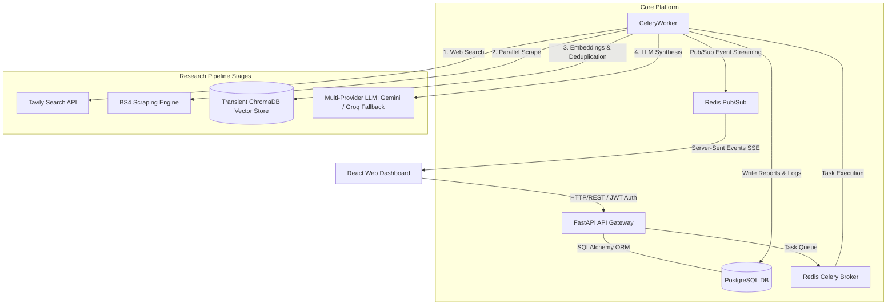
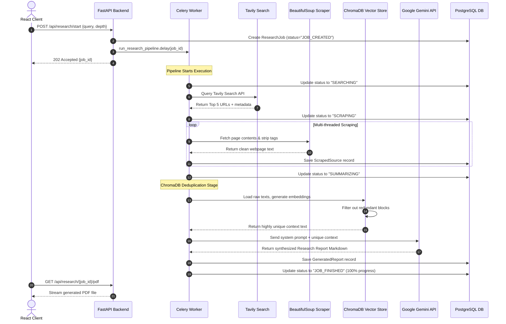

# 🧠 CortexMCP — Autonomous AI Research & Report Engine

CortexMCP is a production-grade, autonomous asynchronous research engine and report generator. It automates the process of executing web searches, scraping raw web contents, semantically chunking and deduplicating information in a transient vector store, and synthesizing comprehensive, multi-section Markdown research reports.

Equipped with a real-time observability interface, CortexMCP streams worker execution steps and status directly from background Celery workers to a responsive React dashboard using a custom-engineered Redis Pub/Sub and Server-Sent Events (SSE) log-terminal system.

---

## 🏛️ System Architecture

CortexMCP's architecture utilizes a modern microservice model designed to isolate user-facing APIs from long-running, CPU-bound research tasks. 



---

## ✨ Key Features

* **⚡ Real-time Observable Logs:** Custom-engineered live log terminal powered by **Redis Pub/Sub** and **Server-Sent Events (SSE)**. Background worker tasks stream UNIX-style logs to the UI dynamically during execution.
* **🎭 Multi-Agent Persona Profiles:** Tailor research runs by choosing custom analytical personas (**General Analyst**, **Academic Reviewer**, **Financial Auditor**, or **Technical Architect**) to dictate writing tone, specialized formatting (e.g., SWOT, scientific citations, system designs), and analytical prompts.
* **🕒 Temporal Delta Tracking:** Run updates on completed research jobs, chronologically linking them using self-referencing database models. View comparative side-by-side **split-screen diffs** and slide out an **AI-powered Delta analysis drawer** that tags changes (additions `[+]`, modifications `[Δ]`, deprecations `[-]`, and verified stable findings `[✓]`).
* **🌐 Intelligent Search & Scraping:** Integrates with the **Tavily Search API** to identify high-quality sources, followed by a multi-threaded parallel web scraping pipeline utilizing **BeautifulSoup4** to sanitize content.
* **🛡️ Semantic Context Deduplication (RAG):** Scraped web text is parsed, chunked, vectorized using **SentenceTransformers (`all-MiniLM-L6-v2`)**, and cross-compared in a local **ChromaDB** database to eliminate redundant articles and boilerplates.
* **🤖 Multi-Provider LLM Orchestrator:** Implements an intelligent, rate-limit immune LLM synthesiser. Defaulting to **Google Gemini 1.5/2.0** for massive **1 million token context windows** and falling back seamlessly to **Groq (Llama-3.1-8B)** if needed.
* **📄 Premium PDF Generation:** Renders synthesized Markdown research documents into styled, print-ready, professional PDF documents using **xhtml2pdf** and streams downloads directly to clients.
* **🔑 Secure JWT Authentication:** User registration, password hashing (`bcrypt`), and stateful cookie-free token validation ensure all research jobs remain isolated, private, and secure.

---

## ⛓️ Research Pipeline Stages & Implementation

| Stage | Name | Key Technologies | Implementation Detail |
| :--- | :--- | :--- | :--- |
| **1** | **Job Queueing** | `FastAPI`, `Celery`, `Redis` | Saves job meta to PostgreSQL, initiates background Celery task, and returns `202 Accepted` immediately. |
| **2** | **Web Search Querying** | `Tavily API`, `HTTPX` | Queries Tavily to gather the top 5 highly relevant web pages, raw URLs, and metadata snippets. |
| **3** | **Parallel Scraping** | `BeautifulSoup4`, `httpx` | Performs multi-threaded HTTP calls to fetch web text, removing boilerplate headers, nav-bars, and script tags. |
| **4** | **Semantic Deduplication** | `SentenceTransformers`, `ChromaDB` | Chunks raw pages, vectorizes them, and queries ChromaDB to retain only unique, high-relevance information. |
| **5** | **LLM Synthesis** | `google-generativeai`, `groq` | Feeds unique context into Gemini (or Groq Llama-3.1 fallback) to write a detailed Markdown report. |
| **6** | **PDF Render & Stream** | `xhtml2pdf`, `FastAPI` | Converts synthesized Markdown into styled HTML, builds a portrait PDF, and streams it to the user's browser. |

---

## 🎨 Dashboard & UX

The frontend is an ultra-premium, dark-mode-first dashboard built using **React**, **Vite** (running on customized port **`5175`** to prevent local developer conflicts), and **Tailwind CSS**.

* **📊 Unified Analytics Dashboard:** Categorizes jobs into filtering tabs (All, Running, Finished, Failed) and visualizes progress percentage bars.
* **💻 Interactive UNIX-style Terminal Console:** Renders live, color-coded logging outputs from the worker during search, scrape, and synthesis steps.
* **📝 Rich Markdown Viewer:** Displays the finalized report using GitHub-styled markdown styling with options to immediately download the print-ready PDF.

---

## 🛠️ Technology Stack

| Layer | Technology | Purpose |
| :--- | :--- | :--- |
| **Frontend** | React 18, Vite, TailwindCSS | Extremely fast, dynamic, glassmorphic dark-theme Single Page Application (SPA). |
| **Vite Port** | Port `5175` | Custom dev server port selection to avoid overlapping ports with other local backend services. |
| **API Gateway** | FastAPI (Python 3.11/3.12) | Asynchronous, auto-documenting API handler with dependency injection and Pydantic validation. |
| **Broker & Queue** | Celery, Redis | Handles long-lived scraping, embedding, and LLM orchestration off the HTTP thread. |
| **Relational DB** | PostgreSQL 16 (Port `5433`) | Maintains users, credentials, research jobs, workflow logs, and finalized reports. |
| **Vector DB** | ChromaDB (SQLite storage) | Temporary vector space utilized to deduplicate scraped texts semantically. |
| **Embeddings Model** | `SentenceTransformers` | `all-MiniLM-L6-v2` generating 384-dimensional semantic text embeddings locally. |
| **Primary LLM** | Google Gemini 1.5 Flash | Synthesizes complex multi-source reports using massive context lengths. |
| **Fallback LLM** | Groq Llama-3.1-8B-Instant | Auto-fallback engine to handle requests in case of API outages. |

---

## 📁 Project Structure

```
CortexMCP/
├── backend/
│   ├── alembic/                # Database migrations
│   ├── app/
│   │   ├── api/                # FastAPI endpoints (auth, research)
│   │   ├── models/             # SQLAlchemy ORM models
│   │   ├── prompts/            # Large Language Model prompts
│   │   ├── pubsub/             # Redis Pub/Sub progress broadcaster
│   │   ├── repositories/       # DB CRUD repository patterns
│   │   ├── schemas/            # Pydantic schemas (request/response validation)
│   │   ├── services/           # Services (LLM, search, scrape, RAG-deduplication)
│   │   ├── utils/              # Security and string helpers
│   │   ├── vectorstore/        # ChromaDB vector initialization
│   │   └── workers/            # Celery app and background tasks
│   ├── .env                    # Active local environment variables
│   ├── Dockerfile              # Backend multi-stage Docker build
│   └── requirements.txt        # Backend python dependencies
├── frontend/
│   ├── src/
│   │   ├── components/         # Protected routes, layout, status badges
│   │   ├── context/            # AuthContext provider
│   │   ├── pages/              # Dashboard, Live Log Page, MD Viewer
│   │   ├── services/           # Axios API services
│   │   ├── utils/              # Status and date formatters
│   │   └── main.jsx            # React root mount
│   ├── Dockerfile              # Frontend multi-stage Docker build
│   └── package.json            # Node packages and tailwind configurations
├── docker-compose.yml          # Core container orchestrator
└── .env.example                # Blank configuration template for setups
```

---

## ⚡ Getting Started

### 📋 Prerequisites
Ensure you have the following installed on your machine:
* [Docker & Docker Compose](https://www.docker.com/)
* [Python 3.11+](https://www.python.org/) *(only if running without Docker)*
* [Node.js 18+](https://nodejs.org/) *(only if running without Docker)*

---

### 🚀 Quick Start (With Docker - Recommended)

1. **Clone the Repository:**
   ```bash
   git clone https://github.com/kshitij189/CortexMCP.git
   cd CortexMCP
   ```

2. **Configure Environment Variables:**
   Copy `.env.example` in the backend folder to `.env`:
   ```bash
   cp .env.example backend/.env
   ```
   Open `backend/.env` and insert your API keys:
   ```env
   TAVILY_API_KEY=your_tavily_key
   GEMINI_API_KEY=your_gemini_key
   GROQ_API_KEY=your_groq_key
   ```

3. **Launch the Container Stack:**
   ```bash
   docker-compose up --build -d
   ```

4. **Access the App:**
   * **Frontend Interface:** [http://localhost:5175](http://localhost:5175)
   * **FastAPI Docs:** [http://localhost:8001/docs](http://localhost:8001/docs)

---

### 💻 Local Development (Without Docker)

If you prefer to run services manually on your local system, set up the services individually:

#### 1. Setup local database & Cache
Ensure PostgreSQL is running locally on port `5433` (database name `cortexmcp`, user `cortex`, password `cortex_secret`) and Redis is active locally on port `6380`.

#### 2. Run the Backend API
```bash
cd backend
python -m venv venv
# Windows:
venv\Scripts\activate
# Linux/macOS:
source venv/bin/activate

pip install -r requirements.txt
# Run database migrations
alembic upgrade head
# Start API
uvicorn app.main:app --host 0.0.0.0 --port 8001 --reload
```

#### 3. Run the Celery Worker
```bash
cd backend
# Windows:
venv\Scripts\activate
celery -A app.workers.celery_app worker --loglevel=info -P threads
# Linux/macOS:
celery -A app.workers.celery_app worker --loglevel=info
```

#### 4. Start the Frontend
```bash
cd frontend
npm install
npm run dev -- --port 5175
```

---

## 📡 API Reference

### 🔐 Authentication Endpoints
* `POST /api/auth/register` — Register a new account.
* `POST /api/auth/token` — Exchange credentials for a JWT access token.
* `GET /api/auth/me` — Retrieve current authenticated user profile.

### 🧠 Research Pipeline Endpoints
* `POST /api/research/start` — Starts a research task. Launches an async pipeline background process. Accepts optional `parent_job_id` UUID inside the request body payload to sequentially link and version research iterations.
* `GET /api/research/jobs` — Lists all current and past research tasks for a user.
* `GET /api/research/{job_id}` — Gets detailed metadata, scraped sources, and generated report markdown for a specific job.
* `GET /api/research/{job_id}/stream` — **SSE (Server-Sent Events)** streaming log console endpoint.
* `GET /api/research/{job_id}/compare` — Performs an AI-powered temporal comparison (Delta report) between a child job and its parent job, generating a structured Markdown analysis mapping changes.
* `GET /api/research/{job_id}/pdf` — Compiles and downloads a print-ready PDF of the research.
* `DELETE /api/research/{job_id}` — Deletes the research job, vector store embeddings, scraped source logs, and database records.

---

## 🔍 Pipeline Deepdive & Data Flow

When a research task is submitted, data moves dynamically through the services:



---

## 🗄️ Database Schema

CortexMCP uses PostgreSQL for relational metadata tracking. All primary keys utilize robust `UUIDs`.

```
   [users]
   ---------
   - id (UUID, PK)
   - email (String, Unique)
   - hashed_password (String)
   - is_active (Boolean)
   - created_at (DateTime)
         |
         | 1:N Relationship
         v
   [research_jobs]
   ----------------
   - id (UUID, PK)
   - user_id (UUID, FK -> users.id)
   - parent_job_id (UUID, FK -> research_jobs.id, Nullable) <---+ Self-Referencing Loop
   - query (Text)                                              |
   - depth (String)                                            |
   - status (String: SEARCHING, SCRAPING, SUMMARIZING, JOB_FINISHED, FAILED)
   - progress (Integer)
   - settings (JSONB)
   - error_message (Text)
   - created_at / updated_at / completed_at (DateTime)
         |
         +-------------------+--------------------+
         | 1:N               | 1:1                | 1:N
         v                   v                    v
   [scraped_sources]   [generated_reports]   [workflow_logs]
   -----------------   -------------------   ---------------
   - id (UUID, PK)     - id (UUID, PK)       - id (UUID, PK)
   - job_id (FK)       - job_id (FK, Unique) - job_id (FK)
   - url (String)      - report_markdown     - step (String)
   - title (String)      (Text)              - message (Text)
   - snippet (Text)    - report_json (JSONB) - level (String)
   - raw_content       - pdf_path (String)   - timestamp (DateTime)
     (Text)            - generated_at
   - is_duplicate        (DateTime)
     (Boolean)
   - relevance_score
     (Float)
```

---

## 🛡️ Strategic Design Decisions

| Decision | Rationale |
| :--- | :--- |
| **Separated API and Worker Containers** | Isolates FastAPI HTTP request processes from CPU/Network-bound vector calculations and multi-threaded scraping tasks, protecting API latency. |
| **Redis Pub/Sub SSE Pipeline** | Replaces heavy polling databases or costly third-party systems (like LangSmith) with zero-cost, high-speed, dynamic terminal logging outputs directly from workers. |
| **ChromaDB Context Deduplication** | Web scrapes are highly redundant. Local text chunking and similarity analysis ensure the LLM receives only unique facts, saving context tokens and optimizing synthesis. |
| **Self-Referencing Temporal Versioning** | Relates successive iterations of research runs directly in the database (`parent_job_id`), preserving full comparative context logs instead of simple destructive document overrides. |
| **Dual Gemini/Groq LLM Fallback** | Gemini provides a massive 1 million token context, ideal for large RAG context sizes. The Groq API acts as a high-speed standby fallback in case of rate limits or service outages. |
| **Vite Dev Server Port `5175`** | Avoids local conflicts with default React Vite runs (`5174`/`5173`) on standard full-stack development setups. |

---

## ⚠️ Known Limitations & Optimizations

* **Cold Start Scraping:** Websites with heavy client-side JavaScript rendering (Single Page Apps) may scrape empty body divs since BeautifulSoup operates without a headless web browser like Playwright.
* **Transient Vector Store:** ChromaDB collections are created on-the-fly and cleaned during job deletion. To scale this system across parallel containers, you can configure a centralized ChromaDB cluster instead of SQLite local volumes.
* **Groq TPM Free Tier:** Groq free-tier limits are capped at **6,000 TPM**. Using the Google Gemini API is highly recommended to synthesize deep content without encountering API token blocks.

---

## 📄 License

Distributed under the MIT License. See `LICENSE` for more details.
